# Дипломный практикум в Yandex.Cloud -- Байков Михаил

  * [Цели:](#цели)
  * [Этапы выполнения:](#этапы-выполнения)
     * [Создание облачной инфраструктуры](#создание-облачной-инфраструктуры)
     * [Создание Kubernetes кластера](#создание-kubernetes-кластера)
     * [Создание тестового приложения](#создание-тестового-приложения)
     * [Подготовка cистемы мониторинга и деплой приложения](#подготовка-cистемы-мониторинга-и-деплой-приложения)
     * [Установка и настройка CI/CD](#установка-и-настройка-cicd)
  * [Что необходимо для сдачи задания?](#что-необходимо-для-сдачи-задания)
  * [Как правильно задавать вопросы дипломному руководителю?](#как-правильно-задавать-вопросы-дипломному-руководителю)

**Перед началом работы над дипломным заданием изучите [Инструкция по экономии облачных ресурсов](https://github.com/netology-code/devops-materials/blob/master/cloudwork.MD).**

---
## Цели:

1. Подготовить облачную инфраструктуру на базе облачного провайдера Яндекс.Облако.
2. Запустить и сконфигурировать Kubernetes кластер.
3. Установить и настроить систему мониторинга.
4. Настроить и автоматизировать сборку тестового приложения с использованием Docker-контейнеров.
5. Настроить CI для автоматической сборки и тестирования.
6. Настроить CD для автоматического развёртывания приложения.

---
## Этапы выполнения:


### Создание облачной инфраструктуры

Для начала необходимо подготовить облачную инфраструктуру в ЯО при помощи [Terraform](https://www.terraform.io/).

Особенности выполнения:

- Бюджет купона ограничен, что следует иметь в виду при проектировании инфраструктуры и использовании ресурсов;
Для облачного k8s используйте региональный мастер(неотказоустойчивый). Для self-hosted k8s минимизируйте ресурсы ВМ и долю ЦПУ. В обоих вариантах используйте прерываемые ВМ для worker nodes.

Предварительная подготовка к установке и запуску Kubernetes кластера.

1. Создайте сервисный аккаунт, который будет в дальнейшем использоваться Terraform для работы с инфраструктурой с необходимыми и достаточными правами. Не стоит использовать права суперпользователя
2. Подготовьте [backend](https://developer.hashicorp.com/terraform/language/backend) для Terraform:  
   а. Рекомендуемый вариант: S3 bucket в созданном ЯО аккаунте(создание бакета через TF)
   б. Альтернативный вариант:  [Terraform Cloud](https://app.terraform.io/)
3. Создайте конфигурацию Terrafrom, используя созданный бакет ранее как бекенд для хранения стейт файла. Конфигурации Terraform для создания сервисного аккаунта и бакета и основной инфраструктуры следует сохранить в разных папках.
4. Создайте VPC с подсетями в разных зонах доступности.
5. Убедитесь, что теперь вы можете выполнить команды `terraform destroy` и `terraform apply` без дополнительных ручных действий.
6. В случае использования [Terraform Cloud](https://app.terraform.io/) в качестве [backend](https://developer.hashicorp.com/terraform/language/backend) убедитесь, что применение изменений успешно проходит, используя web-интерфейс Terraform cloud.

Ожидаемые результаты:

1. Terraform сконфигурирован и создание инфраструктуры посредством Terraform возможно без дополнительных ручных действий, стейт основной конфигурации сохраняется в бакете или Terraform Cloud
2. Полученная конфигурация инфраструктуры является предварительной, поэтому в ходе дальнейшего выполнения задания возможны изменения.

---
### Создание Kubernetes кластера

На этом этапе необходимо создать [Kubernetes](https://kubernetes.io/ru/docs/concepts/overview/what-is-kubernetes/) кластер на базе предварительно созданной инфраструктуры.   Требуется обеспечить доступ к ресурсам из Интернета.

Это можно сделать двумя способами:

1. Рекомендуемый вариант: самостоятельная установка Kubernetes кластера.  
   а. При помощи Terraform подготовить как минимум 3 виртуальных машины Compute Cloud для создания Kubernetes-кластера. Тип виртуальной машины следует выбрать самостоятельно с учётом требовании к производительности и стоимости. Если в дальнейшем поймете, что необходимо сменить тип инстанса, используйте Terraform для внесения изменений.  
   б. Подготовить [ansible](https://www.ansible.com/) конфигурации, можно воспользоваться, например [Kubespray](https://kubernetes.io/docs/setup/production-environment/tools/kubespray/)  
   в. Задеплоить Kubernetes на подготовленные ранее инстансы, в случае нехватки каких-либо ресурсов вы всегда можете создать их при помощи Terraform.
2. Альтернативный вариант: воспользуйтесь сервисом [Yandex Managed Service for Kubernetes](https://cloud.yandex.ru/services/managed-kubernetes)  
  а. С помощью terraform resource для [kubernetes](https://registry.terraform.io/providers/yandex-cloud/yandex/latest/docs/resources/kubernetes_cluster) создать **региональный** мастер kubernetes с размещением нод в разных 3 подсетях      
  б. С помощью terraform resource для [kubernetes node group](https://registry.terraform.io/providers/yandex-cloud/yandex/latest/docs/resources/kubernetes_node_group)
  
Ожидаемый результат:

1. Работоспособный Kubernetes кластер.
2. В файле `~/.kube/config` находятся данные для доступа к кластеру.
3. Команда `kubectl get pods --all-namespaces` отрабатывает без ошибок.

---
### Создание тестового приложения

Для перехода к следующему этапу необходимо подготовить тестовое приложение, эмулирующее основное приложение разрабатываемое вашей компанией.

Способ подготовки:

1. Рекомендуемый вариант:  
   а. Создайте отдельный git репозиторий с простым nginx конфигом, который будет отдавать статические данные.  
   б. Подготовьте Dockerfile для создания образа приложения.  
2. Альтернативный вариант:  
   а. Используйте любой другой код, главное, чтобы был самостоятельно создан Dockerfile.

Ожидаемый результат:

1. Git репозиторий с тестовым приложением и Dockerfile.
2. Регистри с собранным docker image. В качестве регистри может быть DockerHub или [Yandex Container Registry](https://cloud.yandex.ru/services/container-registry), созданный также с помощью terraform.

---
### Подготовка cистемы мониторинга и деплой приложения

Уже должны быть готовы конфигурации для автоматического создания облачной инфраструктуры и поднятия Kubernetes кластера.  
Теперь необходимо подготовить конфигурационные файлы для настройки нашего Kubernetes кластера.

Цель:
1. Задеплоить в кластер [prometheus](https://prometheus.io/), [grafana](https://grafana.com/), [alertmanager](https://github.com/prometheus/alertmanager), [экспортер](https://github.com/prometheus/node_exporter) основных метрик Kubernetes.
2. Задеплоить тестовое приложение, например, [nginx](https://www.nginx.com/) сервер отдающий статическую страницу.

Способ выполнения:
1. Воспользоваться пакетом [kube-prometheus](https://github.com/prometheus-operator/kube-prometheus), который уже включает в себя [Kubernetes оператор](https://operatorhub.io/) для [grafana](https://grafana.com/), [prometheus](https://prometheus.io/), [alertmanager](https://github.com/prometheus/alertmanager) и [node_exporter](https://github.com/prometheus/node_exporter). Альтернативный вариант - использовать набор helm чартов от [bitnami](https://github.com/bitnami/charts/tree/main/bitnami).

### Деплой инфраструктуры в terraform pipeline

1. Если на первом этапе вы не воспользовались [Terraform Cloud](https://app.terraform.io/), то задеплойте и настройте в кластере [atlantis](https://www.runatlantis.io/) для отслеживания изменений инфраструктуры. Альтернативный вариант 3 задания: вместо Terraform Cloud или atlantis настройте на автоматический запуск и применение конфигурации terraform из вашего git-репозитория в выбранной вами CI-CD системе при любом комите в main ветку. Предоставьте скриншоты работы пайплайна из CI/CD системы.

Ожидаемый результат:
1. Git репозиторий с конфигурационными файлами для настройки Kubernetes.
2. Http доступ на 80 порту к web интерфейсу grafana.
3. Дашборды в grafana отображающие состояние Kubernetes кластера.
4. Http доступ на 80 порту к тестовому приложению.
5. Atlantis или terraform cloud или ci/cd-terraform
---
### Установка и настройка CI/CD

Осталось настроить ci/cd систему для автоматической сборки docker image и деплоя приложения при изменении кода.

Цель:

1. Автоматическая сборка docker образа при коммите в репозиторий с тестовым приложением.
2. Автоматический деплой нового docker образа.

Можно использовать [teamcity](https://www.jetbrains.com/ru-ru/teamcity/), [jenkins](https://www.jenkins.io/), [GitLab CI](https://about.gitlab.com/stages-devops-lifecycle/continuous-integration/) или GitHub Actions.

Ожидаемый результат:

1. Интерфейс ci/cd сервиса доступен по http.
2. При любом коммите в репозиторие с тестовым приложением происходит сборка и отправка в регистр Docker образа.
3. При создании тега (например, v1.0.0) происходит сборка и отправка с соответствующим label в регистри, а также деплой соответствующего Docker образа в кластер Kubernetes.

---
## Что необходимо для сдачи задания?

1. Репозиторий с конфигурационными файлами Terraform и готовность продемонстрировать создание всех ресурсов с нуля.
2. Пример pull request с комментариями созданными atlantis'ом или снимки экрана из Terraform Cloud или вашего CI-CD-terraform pipeline.
3. Репозиторий с конфигурацией ansible, если был выбран способ создания Kubernetes кластера при помощи ansible.
4. Репозиторий с Dockerfile тестового приложения и ссылка на собранный docker image.
5. Репозиторий с конфигурацией Kubernetes кластера.
6. Ссылка на тестовое приложение и веб интерфейс Grafana с данными доступа.
7. Все репозитории рекомендуется хранить на одном ресурсе (github, gitlab)

---
# Выполнение дипломного практикума
1. ### Введение 
Цель дипломной работы развертывание и подготовка инфраструктуры для обеспечения разработки в соответствии с принципами CI/CD (Continuous Integration/Continuous Delivery) и IaC (Infrastructure as Code)

2. ### Создание облачной инфраструктуры
Для создания облачной инфраструктуры будем использовать `Terraform` (v1.14.0) на виртуальной машине с которой мы будем управлять инфраструктурой (для этих целей использовалась ВМ с OS Linux Debian12).  
Скачиваем архив с бинарником, распаковываем и для удобства копируем в папку `/usr/bin/`.  
Создаем репозиторий где будем хранить код [ссылка](https://github.com/michel-baykoff/netology-fops-23-diplom).  
Пишем код в котором описываем провайдер для `yandex.cloud`:
```
terraform {
  required_providers {
    yandex = {
      source = "yandex-cloud/yandex"
    }
  }
  required_version = ">= 1.14"
}

provider "yandex" {
    token     = var.token
  #  service_account_key_file = "/home/mikhail/key.json"
  cloud_id  = var.cloud_id
  folder_id = var.folder_id
  zone      = var.default_zone
}
```

Далее пишем код для создания сервисного аккаунта и назначаем ему роль редактора:

```
resource "yandex_iam_service_account" "service" {
  folder_id = var.folder_id
  name      = var.account_name
}

resource "yandex_resourcemanager_folder_iam_member" "service_editor" {
  folder_id = var.folder_id
  role      = "editor"
  member    = "serviceAccount:${yandex_iam_service_account.service.id}"
}
```

Далее подготавливаем код для создания s3 bucket'a и подключаем s3 backend provider:

```
resource "yandex_iam_service_account_static_access_key" "terraform_service_account_key" {
  service_account_id = yandex_iam_service_account.service.id
}

resource "yandex_storage_bucket" "tf-bucket" {
  bucket     = "tf-state-eiw1ooy4ierah1ahregh"
  access_key = yandex_iam_service_account_static_access_key.terraform_service_account_key.access_key
  secret_key = yandex_iam_service_account_static_access_key.terraform_service_account_key.secret_key

  anonymous_access_flags {
    read = false
    list = false
  }

  provisioner "local-exec" {
    command = "echo export AWS_ACCESS_KEY=${yandex_iam_service_account_static_access_key.terraform_service_account_key.access_key} > ./tfbackend.tfvars"
  }

  provisioner "local-exec" {
    command = "echo export AWS_SECRET_KEY=${yandex_iam_service_account_static_access_key.terraform_service_account_key.secret_key} >> ./tfbackend.tfvars"
  }
}

terraform {
  backend "s3" {
    bucket = "tf-state-eiw1ooy4ierah1ahregh"
    key = "tf-state/terraform-s3.tfstate"
    region = "ru-central1"

    endpoint = "https://storage.yandexcloud.net"

    skip_region_validation = true
    skip_credentials_validation = true
    skip_requesting_account_id = true
  }
}
```
Далее пишем код для создания виртуальных машин на которых в дальнейшем будет развернут наш `Kubernetes` кластер. Для большей отказоустойчивости сделаем так, что машины будут разделены по трем зонам доступности (`ru-central1-a, ru-central1-b, ru-central1-d`), по одной управляющей и воркер ноде в каждой зоне доступности.   
Итого: 6 ВМ.
 
Что бы упростить дальнейшую установку кластера, в репозитории создадим директорию `templates` в которой создадим файл шаблона `ansible.tftpl` благодаря которому на основе вывода терраформ будет создан файл инвентори для `ansible`.   

Применим код и проверим, что все ресурсы создаются успешно.   

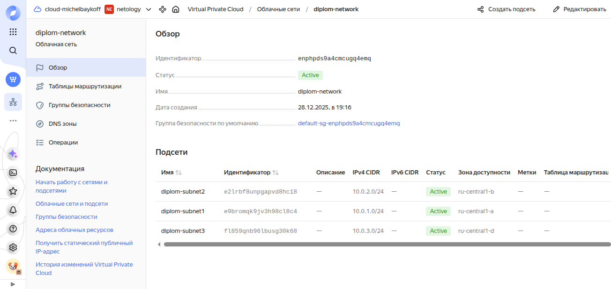
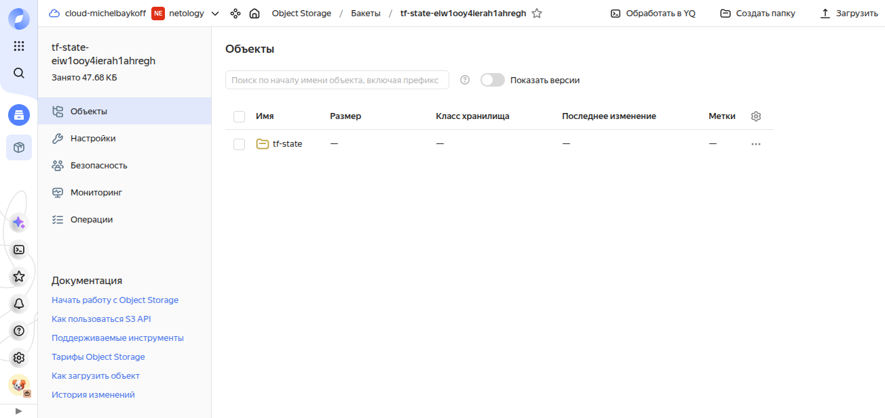

3. ### Создание Kubernetes кластера
 
Для разворачивания `Kubernetes` кластера на созданную инфраструктуру будем использовать репозиторий `Kubespray`.
Клонируем репозиторий `kubespray` и пробуем применить конфигурацию. В процессе попыток применения плейбука столкнулся с проблемами что kubespray требует определенного диапазона версий `ansible`. В официальном репозитории `Debian 12` оказалось слишком устаревшая версия. 
Зная, что многие любят использовать Ubuntu пробовал подключить репозиторий от соответствующей версии ubuntu однако версия хоть и оказалась выше, все равно не подошла. Было принято решение ставить подходящую версию `ansible` через `pip`. 
Создаем виртуальное окружение в котором будем работать через `python3 -m venv ~/ansible-venv`. Активируем виртуальное окружение через `source ~/ansible-venv/bin/activate` и устанавливаем ядро `ansible` командой `pip install ansible-core==2.17.14` и пробуем запустить плейбук, обязательно указав дополнительную переменную `kubeconfig_localhost=true` для того что бы после успешной установки ансибл скопировал нам на ВМ управления готовый конфиг для `kubectl`:   
`ansible-playbook -i inventory/diplomcluster/hosts.yaml -u debian --become --become-user=root --private-key=~/.ssh/id_ed25519 -e 'ansible_ssh_common_args="-o StrictHostKeyChecking=no"' cluster.yml --flush-cache -f 6 --extra-vars "kubeconfig_localhost=true"`  
Первая попытка установки оказалась не успешной из-за отсутствия необходимых зависимостей из ansible galaxy которые по мере необходимости устанавливались командой (для примера) `ansible-galaxy collection install community.crypto`. 
В итоге Kubernetes кластер был успешно установлен, а в директории с артефактами был скопирован конфиг для `kubectl`.    
Копируем в соответствии с контрольными точками дипломной работы конфиг для `kubectl` командой:  
`cp ~/kubespray/inventory/diplomcluster/artifacts/admin.conf ~/.kube/config`   
Проверяем работоспособность кластера командой: `kubectl get pods --all-namespaces`   
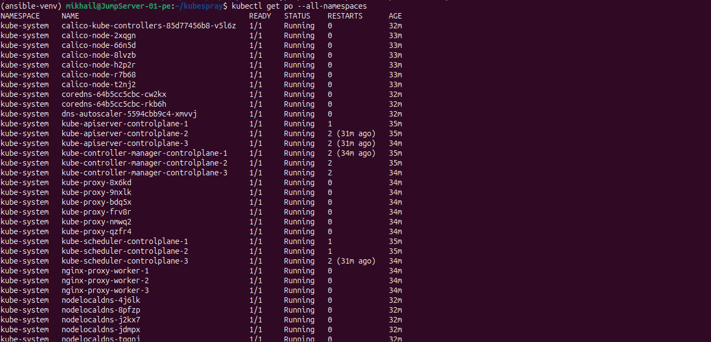

4. ### Создание тестового приложения
Для первичного создания и тестирования сборки приложения будем использовать `Docker`. Создаем статичную страничку `index.html`.   
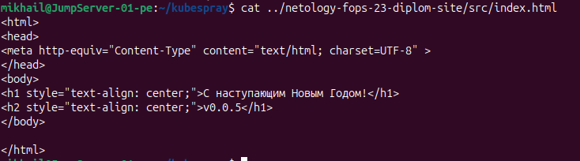   
Далее напишем `Dockerfile` который на основе образа `nginx` создает контейнер с нашей тестовой страницей. Запустим локально контейнер и проверим работоспособность.   
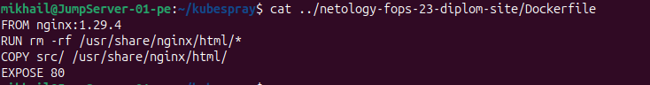   
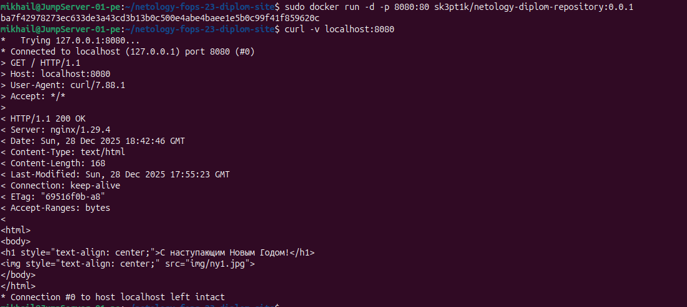   
Загрузим готовый тестовый образ на `hub.docker.com`   
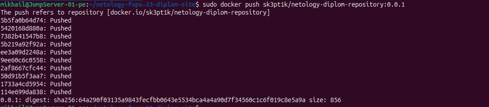   

5. ### Подготовка cистемы мониторинга и деплой приложения
Воспользуемся репозиторием prometheus-community для установки системы мониторинга с помощью helm:   
`helm repo add prometheus-community https://prometheus-community.github.io/helm-charts`   
Далее произведем установку системы мониторинга в кластер:   
`helm upgrade --install monitoring prometheus-community/kube-prometheus-stack --create-namespace -n monitoring -f values.yaml`   
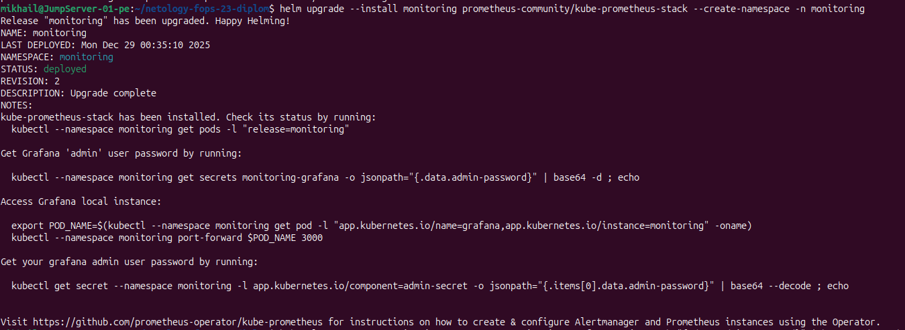   
Далее создадим файл `Deployment.yaml` где опишем деплоймент нашего приложения, поскольку у нас 3 воркер ноды создадим 3 копии приложения и применим наш манифест.    
Так же создадим сервис типа `NodePort` для тестирования доступности приложения и последующего использования.   
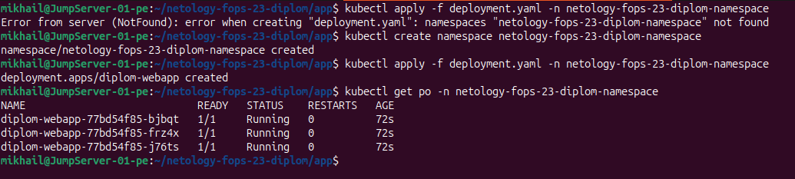

6. ### Деплой инфраструктуры в terraform pipeline
Для автоматизации применения изменений в инфраструктуре настроим CI/CD. Для этого воспользуемся `Github Actions`   
Создадим `workflow` под названием `Terraform`. Предусмотрим как возможность автоматического применения изменений при коммитах в мастер ветку, так и возможность ручного создания или удаления инфраструктуры.   
С финальным вариантом воркфлоу можно ознакомиться по [ссылке](https://github.com/michel-baykoff/netology-fops-23-diplom/actions/workflows/main.yml)   
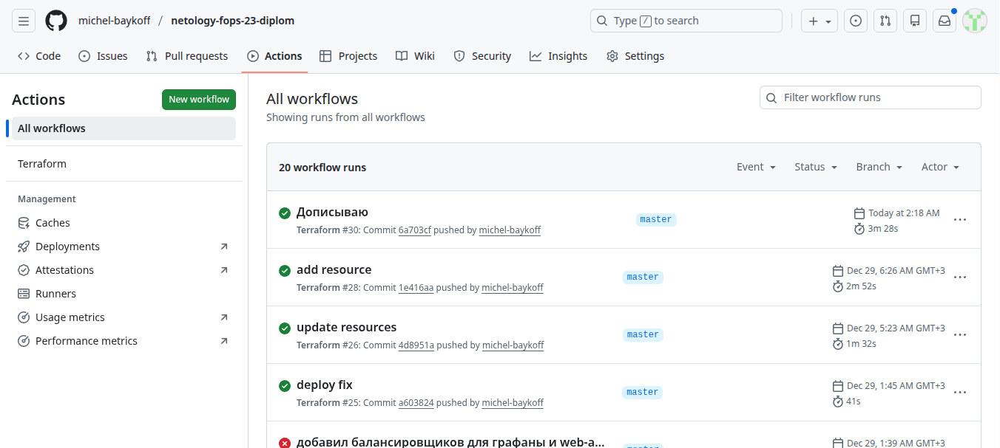  
Так же для выполнения ключевых точек дипломной работы дополним наш код в `Terraform` созданием балансировщика нагрузки и применим через созданный ci/cd.  
Графана доступна на 80 порту и отображает состояние кластера.
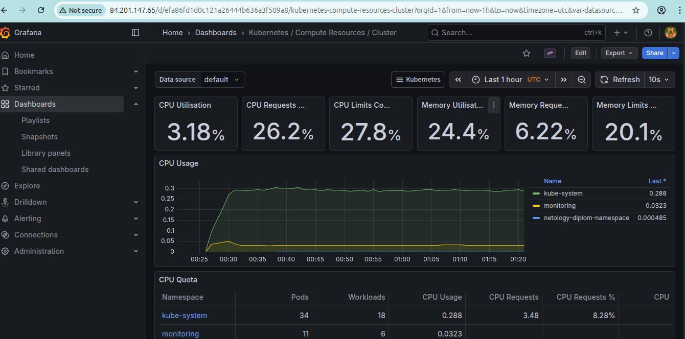
Тестовое приложение доступно на 80 порту.
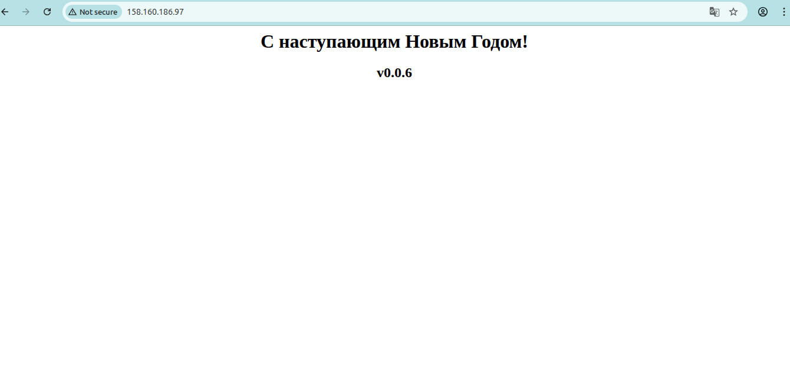
Terraform ci/cd доступен по [ссылке](https://github.com/michel-baykoff/netology-fops-23-diplom/actions/workflows/main.yml)

7. ### Установка и настройка CI/CD
Для минимизации сущностей и унификации поддерживаемых продуктов, в процессе сборки и доставки приложения так же воспользуемся настройкой `workflow` в `Github Actions`.  
Создадим репозиторий для исходных кодов нашего приложения и сопутствующих файлов. [Репозиторий приложения](https://github.com/michel-baykoff/netology-fops-23-diplom-site)  
В директории `src` расположим исходные коды нашего приложения. Так же создадим директорию `k8s` для хранения манифестов нашего приложения.  
Далее приступаем к написанию кода `workflow` и тестированию сборки и деплоя приложения в кластер.  
Согласно заданию при любом коммите в основную ветку происходит сборка контейнера и доставка его в `DockerHub` с тагом `latest`. 
Если же происходит коммит с тагом `v[0-9].[0-9].[0-9]` то происходит сборка контейнера, доставка его в `DockerHub` и деплой приложения с этим тагом в `Kubernetes` кластер.  
Итоговый рабочий вариант `workflow` можно посмотреть [здесь](https://github.com/michel-baykoff/netology-fops-23-diplom-site/actions/workflows/main.yml)  
Репозиторий docker-образов можно посмотреть [здесь](https://hub.docker.com/r/sk3pt1k/netology-diplom-repository)  
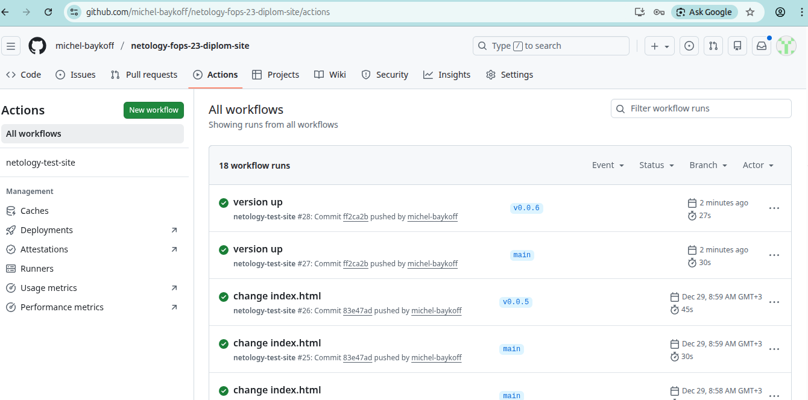

8. ### Выводы
В результате выполнения данной дипломной работы мы реализовали автоматизированную систему управления инфраструктурой и доставки кода на основе принципов IaC и CI/CD.

#### Ссылки
[Репозиторий Терраформ](https://github.com/michel-baykoff/netology-fops-23-diplom/)   
[Terraform workflow](https://github.com/michel-baykoff/netology-fops-23-diplom/actions/workflows/main.yml)  
[Репозиторий тестового приложения](https://github.com/michel-baykoff/netology-fops-23-diplom-site/)  
[CI/CD GitHub Workflow](https://github.com/michel-baykoff/netology-fops-23-diplom-site/actions/workflows/main.yml)  
[Docker Registry на hub.docker.com](https://hub.docker.com/r/sk3pt1k/netology-diplom-repository)  

Приложения в Kubernetes Cluster
```
Grafana
http://84.201.147.65/
login: admin
password: 95z5Y0ZtKvl2tuN9xCBJZLzYBlmrzDNZQhKm5fnW
```

```
WebApp
http://158.160.186.97/
```
